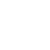
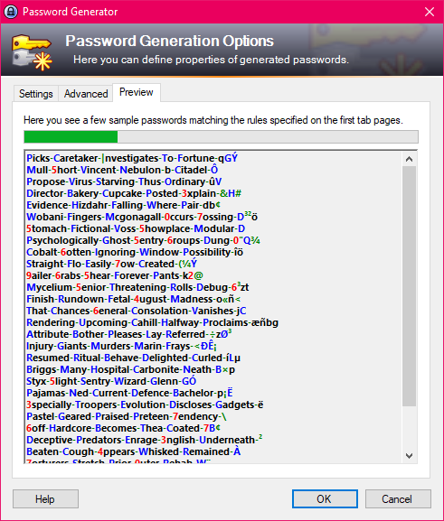
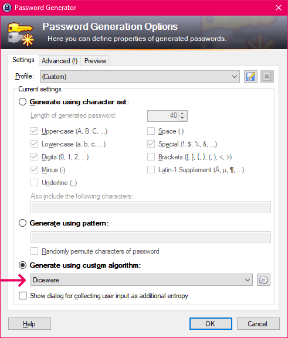
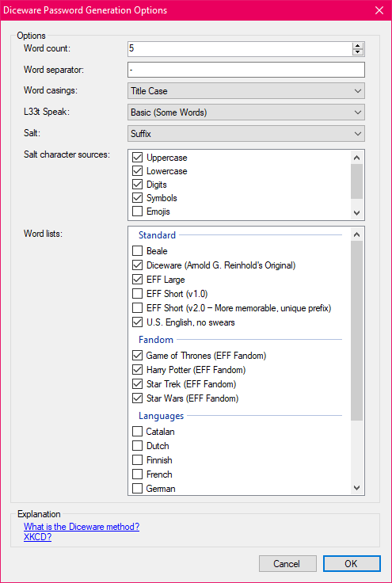

# 🎲🔑 KeePassDiceware
A [KeePass Password Safe](https://keepass.info/) plugin that provides a custom, configurable password generator implementation that generates [diceware](https://theworld.com/~reinhold/diceware.html) style [passwords](https://xkcd.com/936/).

## 🛠️ Installation
Download the latest .dll from the [Release page](https://github.com/cmdwtf/KeePassDiceware/releases) and copy it to your KeePass programm directory.<br>
The default is ```C:\Program Files\KeePass Password Safe 2\Plugins``` and restart / start KeePass. If you did it correctly, it will be listed under Tools > Plugins.

## 🌄 Screenshots



_The Password Generation Preview_



_Where to find and select Diceware in the Password Generator_



_The Options Form_

## 🔰 Project State
This plugin exists because I wanted it for my personal use. I'm sharing it in the hopes someone else out there finds it useful, too. There's bound to be tons of rough edges, bugs, or other issues. Feel free to open an issue or PR if you find anything.

## 💡 Inspiration
I decided to write this because there wasn't anything quite like it. I'm a big fan of [Strongbox](https://strongboxsafe.com/), an iOS and macOS password safe compatable with the KeePass database format. The password generator built into Strongbox offers a diceware method. I decided to replicate it's behavior here, and even offer the same wordlists! The Strongbox source (AGPL-3.0) is available [here](https://github.com/strongbox-password-safe/Strongbox).

## 📝 License
KeePassDiceware is [licensed](./LICENSE) under the AGPL 3.0 (SPDX-License-Identifier: `AGPL-3.0-or-later`).

Copyright © 2021-2023 [Chris Marc Dailey](https://cmd.wtf)

This program is free software: you can redistribute it and/or modify it under the terms of the GNU Affero General Public License as published by the Free Software Foundation, either version 3 of the License, or (at your option) any later version.

This program is distributed in the hope that it will be useful, but WITHOUT ANY WARRANTY; without even the implied warranty of MERCHANTABILITY or FITNESS FOR A PARTICULAR PURPOSE.  See the GNU Affero General Public License for more details.

You should have received a copy of the GNU Affero General Public License along with this program.  If not, see <https://www.gnu.org/licenses/>.

### Licensed Software
KeePassDiceware makes use of licensed portions of code, each licensed under their own terms by their authors. In particular, some of those software licenses require the following notices. The packages themselves may reference other packages, each covered by their own license.

 - NuGet package: [Microsoft.SourceLink.Git](https://github.com/dotnet/sourcelink) — MIT — Copyright (c) .NET Foundation and Contributors

